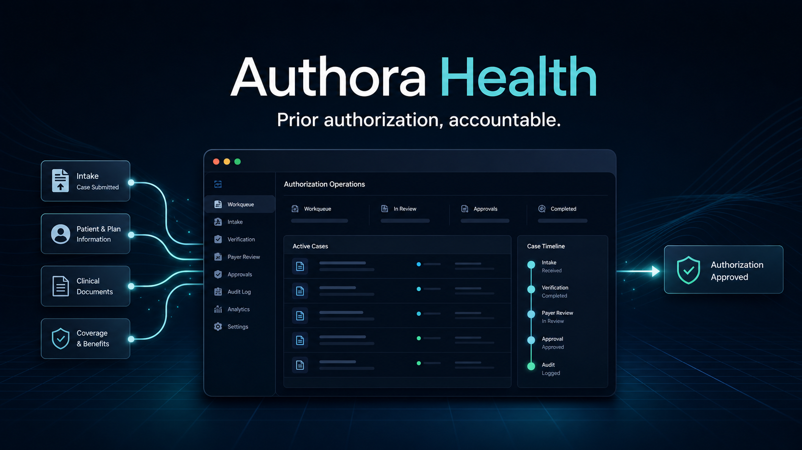

<p align="center">
  
</p>

# Authora Health

Authora Health is a multi-tenant prior authorization operations platform for US specialty-care providers. It gives clinical, authorization, and revenue-cycle teams one accountable workflow for intake, documentation readiness, payer follow-up, decisions, and appeals.

> Product status: foundation and active development. UI examples describe implemented workflow boundaries and do not claim customer outcomes.

## What is implemented

- Next.js web application with corporate login, registration, and workspace dashboard
- Organization-isolated accounts with encrypted, secure, HTTP-only sessions
- Trial subscription foundation and authorization usage limits
- Patient, payer, and authorization-case domain models
- Salesforce External Client App OAuth for identity and organization connections
- Encrypted Salesforce access and refresh tokens
- Connection health checks, audit events, and provisioning state
- Salesforce source package containing custom objects, fields, a validation rule, a permission set, and a readiness Flow
- Authenticated Salesforce connection status, org assessment, package-plan, and provisioning APIs
- Queue-backed provisioning validation with explicit administrator and Metadata API approval boundaries
- Operations workspace with onboarding, authorization, integration, team, security, and settings surfaces
- Corporate About, Security, Privacy, and Terms pages with a reusable brand system
- Versioned architecture decisions and automated tests

## Product architecture

```text
Browser
  │
  ├── https://authora-health.test
  │        Next.js / React / TypeScript / Motion
  │
  └── https://api.authora-health.test
           Secure application API
              ├── Identity and tenant boundary
              ├── Authorization workflow
              ├── Subscription and audit
              ├── Background queues
              └── Salesforce OAuth, REST, and Metadata deployment boundary
```

The web application is intentionally separate from the domain API. Salesforce remains the CRM and service context; Authora remains the operational system of record for authorization workflow evidence.

## Salesforce installation model

After an organization administrator connects Salesforce:

1. Authora validates OAuth identity and API access.
2. The connection is bound to exactly one Authora organization.
3. The onboarding screen explains the metadata package and requested access.
4. A background deployment is queued.
5. Salesforce Metadata API deploys the Authora objects, fields, validation rules, permission set, and Flow as one transaction.
6. Authora polls deployment status and records progress.
7. After validation, the organization enters the operational dashboard.

Salesforce metadata source is stored under [`salesforce/`](salesforce/). Production deployment remains rollback-on-error and requires explicit organization-admin confirmation.

### Integration API

Authenticated, tenant-scoped endpoints:

```text
GET  /api/salesforce          Connection state and sanitized package plan
POST /api/salesforce/assess   Live org capabilities and API capacity
POST /api/salesforce/install  Queue admin-approved provisioning validation
```

The current provisioning worker validates connected-org access and advances the installation to `awaiting_metadata_deploy`. It does not claim a completed installation until a production Metadata API transport submits and verifies the package.

## Security principles

- Every protected business record belongs to an organization.
- Tenant identity comes from the authenticated session, never client input alone.
- Salesforce credentials never enter browser storage.
- Access and refresh tokens are encrypted before persistence.
- PHI is excluded from logs, telemetry, and uncontrolled Salesforce duplication.
- AI output is advisory, source-linked, versioned, and human-reviewed.
- Metadata installation is auditable and transactional.

## Local development

Requirements:

- PHP 8.4 and Composer
- Node.js 22+
- Local HTTPS provided by Herd
- A Salesforce External Client App for live Salesforce flows

```bash
composer install
php artisan migrate

cd frontend
npm install
npm run dev
```

Local endpoints:

- Web: `https://authora-health.test`
- API: `https://api.authora-health.test`

## Validation

```bash
php artisan test
cd frontend && npm run lint && npm run build
```

## Repository structure

```text
app/          Domain, API, tenancy, audit, and integrations
database/     Schema and local persistence
docs/         Architecture decisions
frontend/     Next.js customer application
salesforce/   Salesforce DX metadata source package
tests/        Authentication, tenant, API, and Salesforce tests
```

## License

Proprietary. Copyright © 2026 Authora Health.
